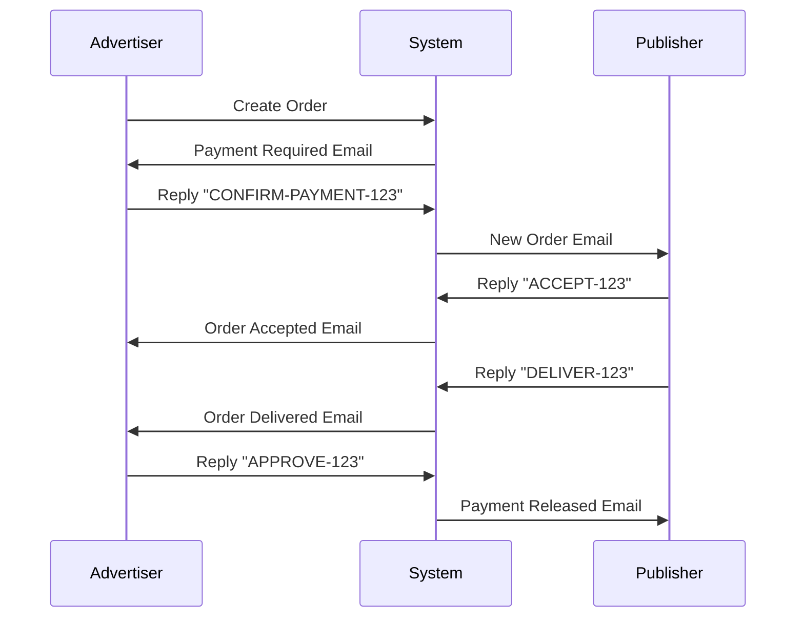
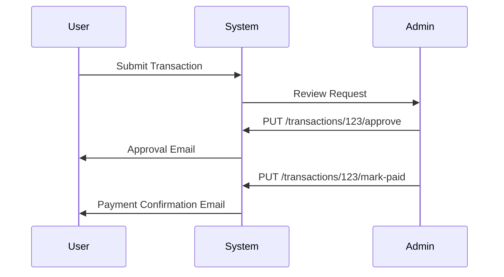

# 📧 Email Operations Integration Guide

## Overview

This system provides comprehensive email-based project operations, allowing users to manage orders, payments, and transactions entirely through email interactions. The system integrates with your existing nodemailer configuration and provides both automated notifications and email command processing.

## 🚀 Features

### ✅ **Order Operations via Email**
- **Create Orders**: Automatic email notifications to publishers and advertisers
- **Accept Orders**: Publishers can reply with `ACCEPT-{OrderID}` 
- **Reject Orders**: Publishers can reply with `REJECT-{OrderID}`
- **Deliver Orders**: Publishers can reply with `DELIVER-{OrderID}`
- **Approve/Complete Orders**: Advertisers can reply with `APPROVE-{OrderID}`
- **Dispute Orders**: Advertisers can reply with `DISPUTE-{OrderID}`

### 💰 **Payment Operations via Email**
- **Payment Confirmations**: Advertisers receive payment request emails
- **Payment Processing**: Reply with `CONFIRM-PAYMENT-{OrderID}` to confirm
- **Transaction Approvals**: Admin can approve transactions via API
- **Transaction Denials**: Admin can deny transactions with reasons
- **Payment Confirmations**: Automatic confirmation emails

### 📨 **Email Templates**
- **Professional HTML templates** for all operations
- **Mobile-responsive design** with inline CSS
- **Clear call-to-action buttons** and instructions
- **Branded styling** with SerpBays colors

## 🔧 Setup Instructions

### 1. **Email Service Configuration**

Your nodemailer is already configured in `config/plugins.js`. Ensure these environment variables are set:

```bash
SMTP_HOST=smtp.gmail.com
SMTP_PORT=587
SMTP_USERNAME=your-email@domain.com
SMTP_PASSWORD=your-app-password
EMAIL_FROM=noreply@serpbays.com
EMAIL_REPLY_TO=support@serpbays.com
```

### 2. **Webhook Configuration**

Set up email webhooks with your email service provider:

#### **SendGrid Setup**
```bash
# Add webhook URL in SendGrid dashboard
https://yourdomain.com/api/email/webhook
```

#### **Mailgun Setup**
```bash
# Add route in Mailgun dashboard
match_recipient(".*@yourdomain.com")
forward("https://yourdomain.com/api/email/webhook")
```

### 3. **Testing Email Operations**

Use the test endpoint for development:

```bash
curl -X POST http://localhost:1337/api/email/test \
  -H "Content-Type: application/json" \
  -d '{
    "type": "payment_required",
    "email": "test@example.com",
    "orderId": 1
  }'
```

## 📋 API Endpoints

### **Email Operations**

```bash
# Webhook for incoming emails (no auth)
POST /api/email/webhook

# Manual command processing
POST /api/email/process-command
{
  "command": "ACCEPT",
  "entityId": 123,
  "userEmail": "user@example.com"
}

# Trigger order operation emails
POST /api/email/trigger-order-operation
{
  "operation": "order_created",
  "orderId": 123
}

# Trigger transaction operation emails
POST /api/email/trigger-transaction-operation
{
  "operation": "approve",
  "transactionId": 456,
  "reason": "Optional reason for denial"
}

# Get email statistics (admin only)
GET /api/email/stats

# Test email operations (development only)
POST /api/email/test
```

### **Transaction Operations**

```bash
# Approve transaction (admin only)
PUT /api/transactions/:id/approve

# Deny transaction (admin only)
PUT /api/transactions/:id/deny
{
  "reason": "Insufficient documentation"
}

# Mark transaction as paid (admin only)
PUT /api/transactions/:id/mark-paid
```

## 📧 Email Commands

### **For Publishers**
```
ACCEPT-123    # Accept order #123
REJECT-123    # Reject order #123
DELIVER-123   # Mark order #123 as delivered
```

### **For Advertisers**
```
CONFIRM-PAYMENT-123  # Confirm payment for order #123
APPROVE-123          # Approve/complete order #123
DISPUTE-123          # Dispute order #123
```

### **Command Format**
- Commands are **case-insensitive**
- Must include the **entity ID** (order ID, transaction ID)
- Can be placed **anywhere in the email body**
- Support for **multiple commands** in one email

## 🔄 Workflow Examples

### **1. Order Creation Flow**



### **2. Transaction Processing Flow**



## 🎨 Email Templates

### **Payment Required Template**
- Clean, professional design
- Clear amount and order information
- Simple reply instructions
- Mobile-responsive layout

### **Order Management Templates**
- Order details with pricing
- Service type information
- Action buttons and instructions
- Status tracking information

### **Transaction Templates**
- Transaction details
- Status updates
- Approval/denial reasons
- Payment confirmations

## 🔒 Security Features

### **Authentication**
- **User verification** by email address
- **Permission checks** for all operations
- **Admin-only functions** for sensitive operations

### **Validation**
- **Command format validation**
- **Entity existence checks**
- **User permission verification**
- **Rate limiting** on email endpoints

### **Error Handling**
- **Graceful error responses** via email
- **Detailed error logging**
- **Fallback mechanisms** for failed operations

## 🛠️ Customization

### **Email Templates**
Modify templates in `email-operations.js`:

```javascript
generateOrderCreationTemplate(order, recipient) {
  // Customize HTML template here
  return `<!DOCTYPE html>...`;
}
```

### **Command Processing**
Add new commands in `parseEmailCommand()`:

```javascript
const commands = [
  'CONFIRM-PAYMENT',
  'ACCEPT',
  'REJECT',
  // Add your custom commands here
];
```

### **Email Styling**
Update the CSS in template functions:

```css
.header { 
  background: #007bff; 
  color: white; 
  padding: 20px; 
}
```

## 📊 Monitoring & Analytics

### **Email Statistics**
- Total emails sent per operation type
- Success/failure rates
- Response times
- User engagement metrics

### **Error Tracking**
- Failed email deliveries
- Invalid command attempts
- Authentication failures
- System errors

### **Performance Metrics**
- Email processing speed
- Database operation times
- API response times
- Webhook processing efficiency

## 🚨 Troubleshooting

### **Common Issues**

#### **Emails not sending**
```bash
# Check SMTP configuration
npm run config:check

# Test email service
curl -X POST /api/email/test
```

#### **Commands not processing**
```bash
# Check webhook configuration
# Verify email format
# Check user permissions
```

#### **Database errors**
```bash
# Check entity relationships
# Verify user associations
# Review transaction status
```

### **Debug Mode**
Enable debug logging:

```javascript
// In email-operations.js
console.log('Processing email command:', command, entityId, senderEmail);
```

## 🔮 Future Enhancements

### **Planned Features**
- **Bulk operation support** via email
- **Advanced filtering** for email commands
- **Email scheduling** for delayed operations
- **Multi-language support** for templates
- **Advanced analytics** dashboard
- **Email signature verification**
- **Automated follow-ups** for pending operations

### **Integration Opportunities**
- **SMS notifications** for critical operations
- **Slack/Discord integration** for team notifications
- **Calendar integration** for deadline tracking
- **CRM integration** for customer management

## 📞 Support

For technical support with email operations:

1. **Check this documentation** first
2. **Review error logs** in the admin dashboard
3. **Test with the development endpoints**
4. **Contact the development team** with specific error details

---

**Built with ❤️ for SerpBays** 
*Making project operations as simple as sending an email*
